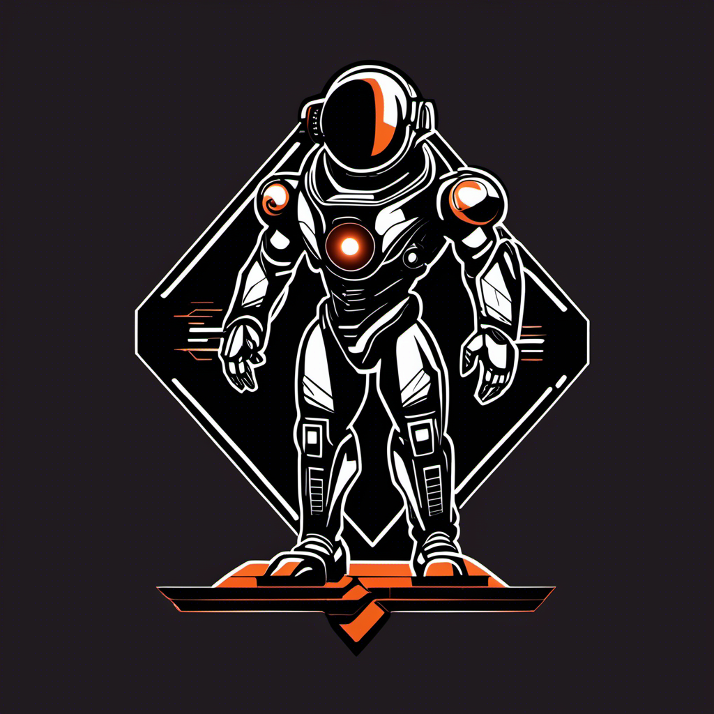

# bedrock-youtube-analyzer

This is a youtube analyzer that leverages Amazon Bedrock




Welcome to the YouTube Analysis Assistant, a tool designed to help you optimize and enhance your YouTube content using the power of large language models. This assistant can suggest engaging titles, SEO tags, thumbnail designs, content enhancements, and segments with viral potential for your YouTube videos.

## Getting Started

These instructions will get you a copy of the project up and running on your local machine for development and testing purposes.

### Prerequisites

What things you need to install the software and how to install them:

- Python 3.6+
- Pip (Python package installer)
- Virtual environment (optional but recommended)
- AWS Account
- [Amazon Bedrock (Claude V2.1) model access](https://docs.aws.amazon.com/bedrock/latest/userguide/model-access.html#add-model-access)

### Installation

A step-by-step series of examples that tell you how to get a development environment running:

1. **Clone the repository**
    ```sh
    git clone https://github.com/labeveryday/bedrock-youtube-analyzer.git
    ```
2. **Navigate to the project directory**
    ```sh
    cd bedrock-youtube-analyzer
    ```

3. **Set up a Python virtual environment (Optional but recommended)**
    ```sh
    python3 -m venv venv
    source venv/bin/activate  # On Windows use `venv\Scripts\activate`
    ```

4. **Install the required packages**
    ```sh
    pip install -r requirements.txt
    ```

5. **Run the Streamlit application**
    ```sh
    streamlit run app.py
    ```

### Usage

Once the application is running, you can interact with it through the Streamlit UI in your web browser.

1. **Insert the YouTube URL** you wish to analyze in the sidebar input.
2. **Click Submit** to process the video through the YouTube Loader.
3. **Interact with the analysis assistant** by typing in your questions or commands.

### Features

- Video transcript fetching and processing
- Conversation with LLM for content suggestions
- UI components for a user-friendly experience
- Transcript download functionality

### File Descriptions

- `main.py`: The main application script that contains the Streamlit UI and logic.
- `requirements.txt`: A list of necessary Python packages.

## License

This project is licensed under the MIT License - see the [LICENSE.md](LICENSE.md) file for details

### About me

My passions lie in Network Engineering, Cloud Computing, Automation, and impacting people's lives. I'm fortunate to weave all these elements together in my role as a Developer Advocate. On GitHub, I share my ongoing learning journey and the projects I'm building. Don't hesitate to reach out for a friendly hello or to ask any questions!

My hangouts:
- [LinkedIn](https://www.linkedin.com/in/duanlightfoot/)
- [YouTube](https://www.youtube.com/@LabEveryday)
